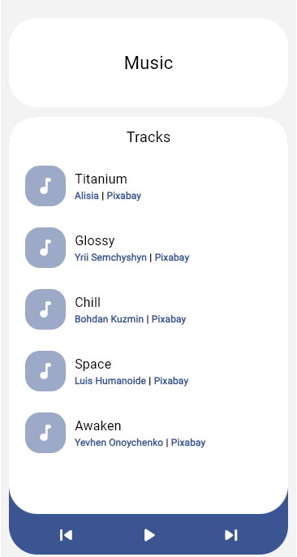

# 🎵 Flutter Audio Player

## 🌟 Introduction

A simple Flutter application to play audio files from Music folder in Windows 🖥️ and Downloads folder in Android📱

**Note:** This project is designed to be beginner-friendly and serves as one of my foundational projects in Flutter app development education.

## Screenshot

### [See Web Showcase 🎉](https://tonygnk.github.io/flutter-audio-player/)

## ✨ Features

-   Scan and list audio files mp3, wav, m4a and aac
-   Play audio
-   Basic music controls (play, pause, next, previous)
-   Theme Switcher and Listener (Dark Theme, Light Theme, System)

## 🤝 Contributing

#### Contributions are welcome! If you'd like to contribute, please follow these guidelines:

1. Fork the repository and create a new branch for your feature.
2. Make your changes and ensure they are well-tested.
3. Submit a pull request describing your changes and their purpose.

## 📄 License

This project is licensed under the [MIT License](LICENSE).
