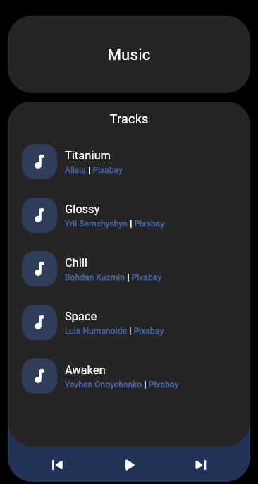

# 🎵 Flutter Audio Player

## 🌟 Introduction

A simple Flutter application to play audio files from Music folder in Windows 🖥️ and Downloads folder in Android📱

## Screenshot

[Try my app here](https://play.google.com/store/apps/details?id=com.example.myapp)
<a href="https://play.google.com/store/apps/details?id=com.example.myapp" target="_blank">Try my app here</a>

## ✨ Features

-   Scan and list music files from the Downloads folder.
-   Play music tracks.
-   Basic music controls (play, pause, next, previous)

## 🤝 Contributing

Contributions to Project SwitchOS are welcome! If you'd like to contribute, please follow these guidelines:

1. Fork the repository and create a new branch for your feature.
2. Make your changes and ensure they are well-tested.
3. Submit a pull request describing your changes and their purpose.

## 📄 License

This project is licensed under the [MIT License](LICENSE).
